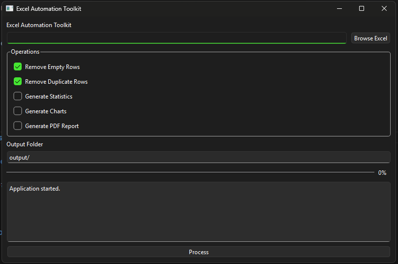
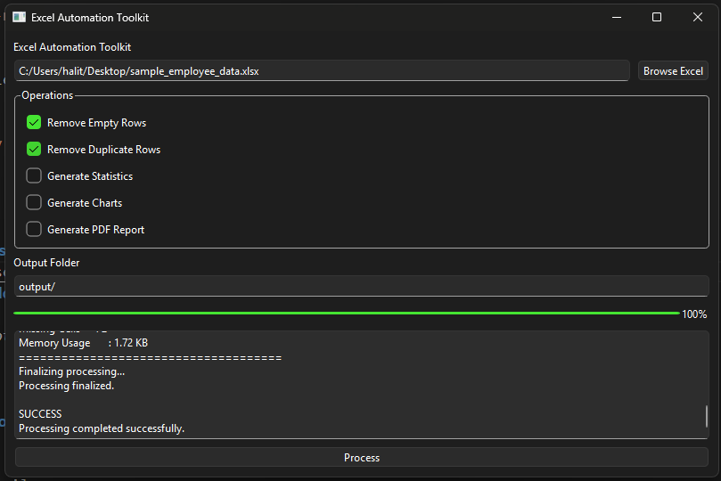

    

# 📊 Excel Automation Toolkit

A professional desktop application built with **Python** and **PySide6** for cleaning, processing and analyzing Excel files.

This project was developed as a portfolio application to demonstrate desktop application development, data processing and clean software architecture.

---

## ✨ Features

### ✅ Excel Processing

- Load Excel (.xlsx, .xls) files
- Remove empty rows
- Remove duplicate rows
- Save cleaned Excel files automatically

### 📈 Statistics

- Total rows
- Total columns
- Numeric columns
- Text columns
- Missing cells
- Memory usage

### 🖥 User Interface

- Modern PySide6 interface
- Progress bar
- Processing log
- Output folder selection
- Modular architecture

---

## 🛠 Technologies

- Python 3.11+
- PySide6
- Pandas
- OpenPyXL

---

## 📁 Project Structure

```text
excel-automation-toolkit/
│
├── app.py
├── requirements.txt
├── README.md
│
├── output/
│
└── src/
    ├── gui.py
    ├── excel_processor.py
    └── statistics.py
```

---

## 🚀 Installation

Clone the repository

```bash
git clone https://github.com/yourusername/excel-automation-toolkit.git
```

Go into the project

```bash
cd excel-automation-toolkit
```

Install dependencies

```bash
pip install -r requirements.txt
```

Run the application

```bash
python app.py
```

---

## 📷 Screenshots
### Main Window

### Processing Result

---

## 🔄 Workflow

```text
Select Excel File
        │
        ▼
Load Excel
        │
        ▼
Remove Empty Rows
        │
        ▼
Remove Duplicate Rows
        │
        ▼
Generate Statistics
        │
        ▼
Save Cleaned Excel
```

---

## 📋 Sample Output

```text
========== PROCESS SUMMARY ==========

Original Rows      : 12
Current Rows       : 9
Removed Empty Rows : 1
Removed Duplicates : 2

-------------------------------------

Columns            : 5
Numeric Columns    : 2
Text Columns       : 3
Missing Cells      : 2
Memory Usage       : 1.72 KB

=====================================
```

---

## 🗺 Roadmap

### ✅ Version 0.2

- Excel Processing
- Remove Empty Rows
- Remove Duplicate Rows
- Statistics Engine
- Processing Log
- Progress Bar

### 🚧 Planned Features

- Data Visualization
- PDF Report Generator
- Dashboard
- Batch Processing
- Drag & Drop Support
- Dark Theme
- CSV Support
- Export Statistics
- Settings Panel

---

## 🚀 Future Plans

- Dashboard
- Charts
- PDF Reports
- Batch Processing
- Drag & Drop
- CSV Support
- Settings
- Multi Sheet Processing
- Multi Language Support

---

## 🎯 Purpose

This project is part of my software engineering portfolio and focuses on:

- Desktop Application Development
- Data Processing
- Object-Oriented Programming
- Clean Architecture
- Modular Design

---

## 📄 License

This project is licensed under the MIT License.

---

## 👨‍💻 Author

**Halit Tiryaki**

Computer Teacher & Python Developer

GitHub:
https://github.com/halittiryaki