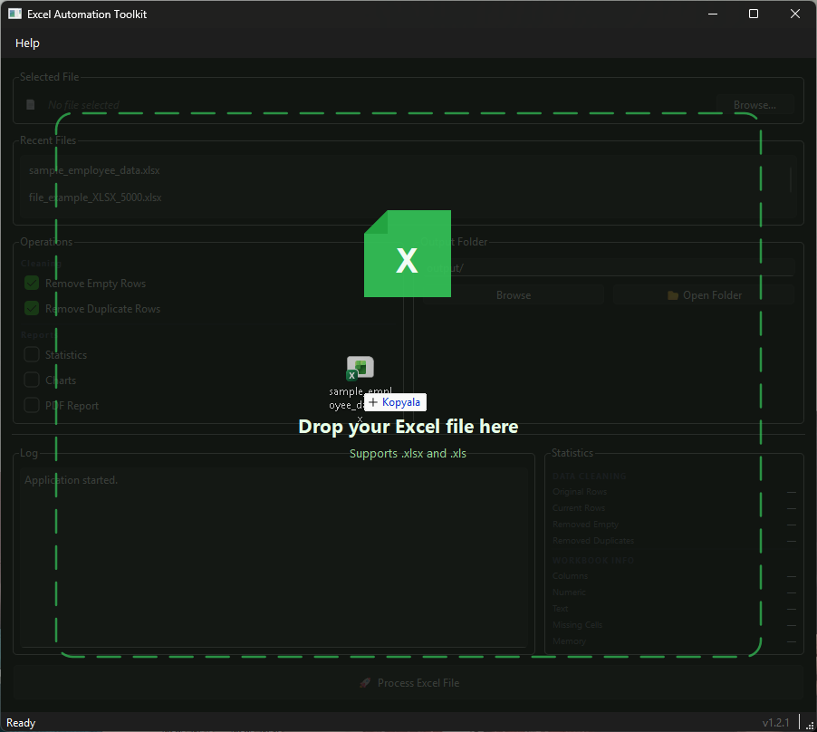
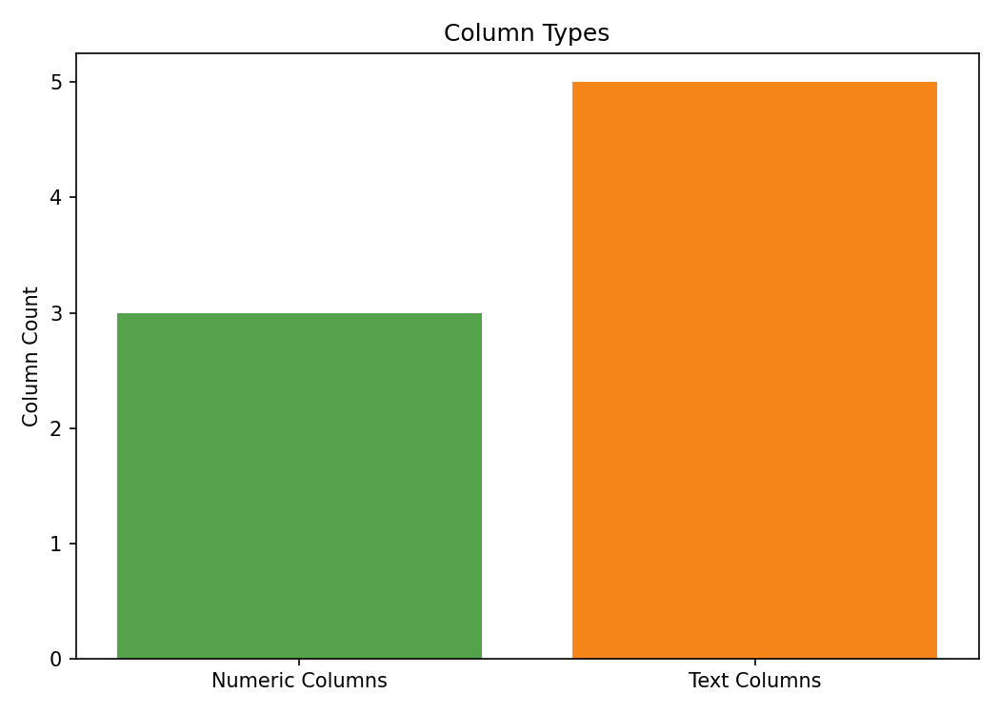
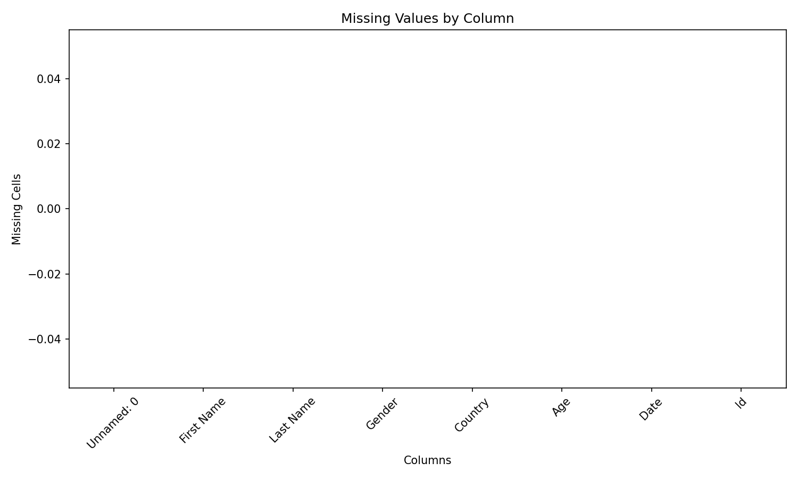
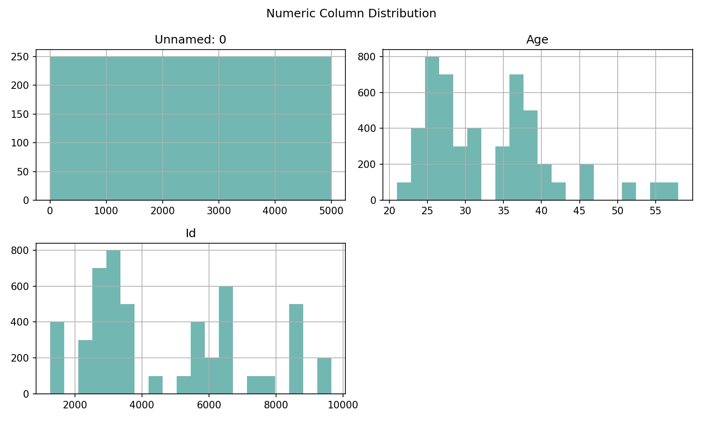

# 📊 Excel Automation Toolkit

A modern desktop application built with **Python** and **PySide6** for cleaning, processing, analyzing, and visualizing Excel files.

The application automates common Excel workflows including data cleaning, statistical analysis, chart generation, PDF reporting, and provides an intuitive desktop experience with a modern dark interface.

This project was developed as part of my software engineering portfolio to demonstrate desktop application development, clean architecture, and Excel automation using Python.

---

# ✨ Features

## 📂 Excel Processing

- Load Excel (.xlsx / .xls) files
- Drag & Drop support
- Remove empty rows
- Remove duplicate rows
- Save cleaned Excel files automatically

---

## 📁 File Management

- Recent Files history
- Remember last used folder
- Custom output folder
- Open output folder with one click
- Browse output directory
- Full file path tooltips

---

## 📈 Statistics Dashboard

Generate useful information about your dataset.

- Original rows
- Current rows
- Removed empty rows
- Removed duplicate rows
- Total columns
- Numeric columns
- Text columns
- Missing cells
- Memory usage

---

## 📊 Automatic Chart Generation

Generate charts automatically after processing.

Current charts include:

- Missing Values Chart
- Column Types Chart
- Numeric Distribution Chart

Charts are exported as PNG files.

---

## 📄 PDF Report Generation

Generate a professional PDF report including:

- Processing summary
- Workbook statistics
- Charts
- Processing information

---

## 🖥 Modern Desktop Interface

- Modern Dark Theme
- Drag & Drop Overlay
- Organized Dashboard Layout
- Processing Log
- Statistics Panel
- Progress Bar
- Status Bar
- About Dialog
- Tooltips
- Success Dialog
- Responsive Layout

---

# 🛠 Technologies

- Python 3.11+
- PySide6
- Pandas
- OpenPyXL
- Matplotlib
- ReportLab

---

# 📁 Project Structure

```text
excel-automation-toolkit/

├── app.py
├── requirements.txt
├── LICENSE
├── README.md
│
├── config/
│   └── recent_files.json
│
├── output/
│   ├── cleaned_data.xlsx
│   ├── report.pdf
│   └── charts/
│
├── services/
│   ├── recent_files_manager.py
│   └── settings_manager.py
│
└── src/
    ├── core/
    │   ├── excel_processor.py
    │   ├── statistics.py
    │   ├── charts.py
    │   └── pdf_report.py
    │
    └── gui/
        ├── main_window.py
        ├── statistics_panel.py
        └── drop_overlay.py
```

---

# 🚀 Installation

Clone the repository

```bash
git clone https://github.com/halittiryakicom/excel-automation-toolkit.git
```

Enter the project folder

```bash
cd excel-automation-toolkit
```

Install dependencies

```bash
pip install -r requirements.txt
```

Run the application

```bash
python app.py
```

---

# 📷 Screenshots

## Main Window


---

## Drag & Drop



---

## Processing Result


---

## Generated Charts







---

# 🔄 Workflow

```text
Select or Drag Excel File
            │
            ▼
      Load Workbook
            │
            ▼
       Clean Data
            │
            ▼
 Generate Statistics
            │
            ▼
   Generate Charts
            │
            ▼
 Generate PDF Report
            │
            ▼
      Save Results
```

---

# 📦 Output

After processing, the application automatically creates:

```text
output/

├── cleaned_data.xlsx

├── report.pdf

└── charts/

    ├── missing_values.png

    ├── column_types.png

    └── numeric_distribution.png
```

---

# 🎯 Project Goals

This project demonstrates:

- Desktop Application Development
- Excel Automation
- Data Cleaning
- Data Visualization
- PDF Report Generation
- Object-Oriented Programming
- Clean Architecture
- Python GUI Development
- Modular Software Design

---

# 🗺 Roadmap

## ✅ Version 1.2.1

- Drag & Drop Support
- Drag Overlay
- Remember Last Folder
- Recent Files
- Statistics Dashboard
- Chart Generation
- PDF Report Generation
- Modern UI
- Responsive Layout
- Output Folder Management
- Processing Log
- Status Bar
- About Dialog
- Tooltips
- GitHub Release

---

## 🚀 Future Ideas

- Batch Processing
- CSV Support
- Multi-sheet Processing
- Export Statistics
- Auto Update
- Plugin Support
- Localization (TR / EN)

---

# 📄 License

Licensed under the MIT License.

---

# 👨‍💻 Author

## Halit Tiryaki

**Python Developer • Automation Engineer**

🌐 Website

https://halittiryaki.com

🐙 GitHub

https://github.com/halittiryakicom

---

⭐ If you like this project, consider giving it a star.